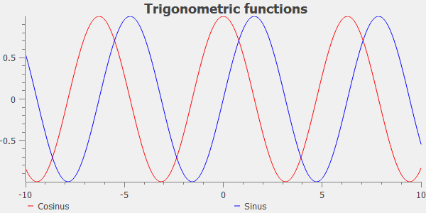

# PythonQwt: Qt plotting widgets for Python

[](./LICENSE)
[](https://pypi.org/project/PythonQwt/)
[](https://github.com/PlotPyStack/PythonQwt)
[](https://pypi.python.org/pypi/PythonQwt/)
[](https://www.anaconda.com/download/)
[](https://pythonqwt.readthedocs.io/en/latest/?badge=latest)

ℹ️ Created in 2014 by Pierre Raybaut and maintained by the [PlotPyStack](https://github.com/PlotPyStack) organization.


The `PythonQwt` project was initiated to solve -at least temporarily- the
obsolescence issue of `PyQwt` (the Python-Qwt C++ bindings library) which is
no longer maintained. The idea was to translate the original Qwt C++ code to
Python and then to optimize some parts of the code by writing new modules
based on NumPy and other libraries.

The `PythonQwt` package consists of a single Python package named `qwt` and
of a few other files (examples, doc, ...).

See documentation [online](https://pythonqwt.readthedocs.io/en/latest/) or [PDF](https://pythonqwt.readthedocs.io/_/downloads/en/latest/pdf/) for more details on the library and [changelog](CHANGELOG.md) for recent history of changes.

## Sample

```python
import qwt
import numpy as np

app = qwt.qt.QtGui.QApplication([])

# Create plot widget
plot = qwt.QwtPlot("Trigonometric functions")
plot.insertLegend(qwt.QwtLegend(), qwt.QwtPlot.BottomLegend)

# Create two curves and attach them to plot
x = np.linspace(-10, 10, 500)
qwt.QwtPlotCurve.make(x, np.cos(x), "Cosinus", plot, linecolor="red", antialiased=True)
qwt.QwtPlotCurve.make(x, np.sin(x), "Sinus", plot, linecolor="blue", antialiased=True)

# Resize and show plot
plot.resize(600, 300)
plot.show()

app.exec_()
```



## Examples (tests)

The GUI-based test launcher may be executed from Python:

```python
from qwt import tests
tests.run()
```

or from the command line:

```bash
PythonQwt
```

Tests may also be executed in unattended mode:

```bash
PythonQwt-tests --mode unattended
```

## Overview

The `qwt` package is a pure Python implementation of `Qwt` C++ library with
the following limitations.

The following `Qwt` classes won't be reimplemented in `qwt` because more
powerful features already exist in `guiqwt`: `QwtPlotZoomer`,
`QwtCounter`, `QwtEventPattern`, `QwtPicker`, `QwtPlotPicker`.

Only the following plot items are currently implemented in `qwt` (the only
plot items needed by `guiqwt`): `QwtPlotItem` (base class), `QwtPlotItem`,
`QwtPlotMarker`, `QwtPlotSeriesItem` and `QwtPlotCurve`.

See "Overview" section in [documentation](https://pythonqwt.readthedocs.io/en/latest/)
for more details on API limitations when comparing to Qwt.

## Roadmap

The `qwt` package short-term roadmap is the following:

- [X] Drop support for PyQt4 and PySide2
- [X] Drop support for Python < 3.8
- [X] Replace `setup.py` by `pyproject.toml`, using `setuptools` (e.g. see `guidata`)
- [ ] Add more unit tests: the ultimate goal is to reach 90% code coverage

## Dependencies

### Requirements

- Python >=3.8
- PyQt5, PyQt6 or PySide6
- QtPy >= 1.3
- NumPy >= 1.5

### Optional dependencies

- coverage, pytest, pytest-qt, pytest-cov (for unit tests)
- sphinx (for documentation generation)

## Installation

From the source package:

```bash
python -m build
```

## Copyrights

### Main code base

- Copyright © 2002 Uwe Rathmann, for the original Qwt C++ code
- Copyright © 2015 Pierre Raybaut, for the Qwt C++ to Python translation and
optimization
- Copyright © 2015 Pierre Raybaut, for the PythonQwt specific and exclusive
Python material

### PyQt, PySide and Python2/Python3 compatibility modules

- Copyright © 2009-2013 Pierre Raybaut
- Copyright © 2013-2015 The Spyder Development Team

### Some examples

- Copyright © 2003-2009 Gerard Vermeulen, for the original PyQwt code
- Copyright © 2015 Pierre Raybaut, for the PyQt5/PySide port and further
developments (e.g. ported to PythonQwt API)

## License

The `qwt` Python package was partly (>95%) translated from Qwt C++ library:
the associated code is distributed under the terms of the LGPL license. The
rest of the code was either wrote from scratch or strongly inspired from MIT
licensed third-party software.

See included [LICENSE](LICENSE) file for more details about licensing terms.
